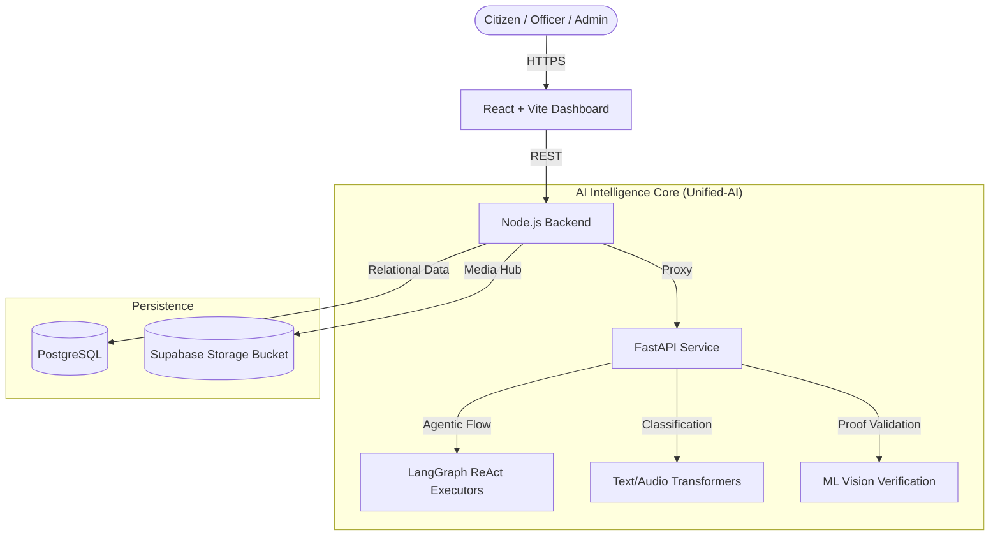
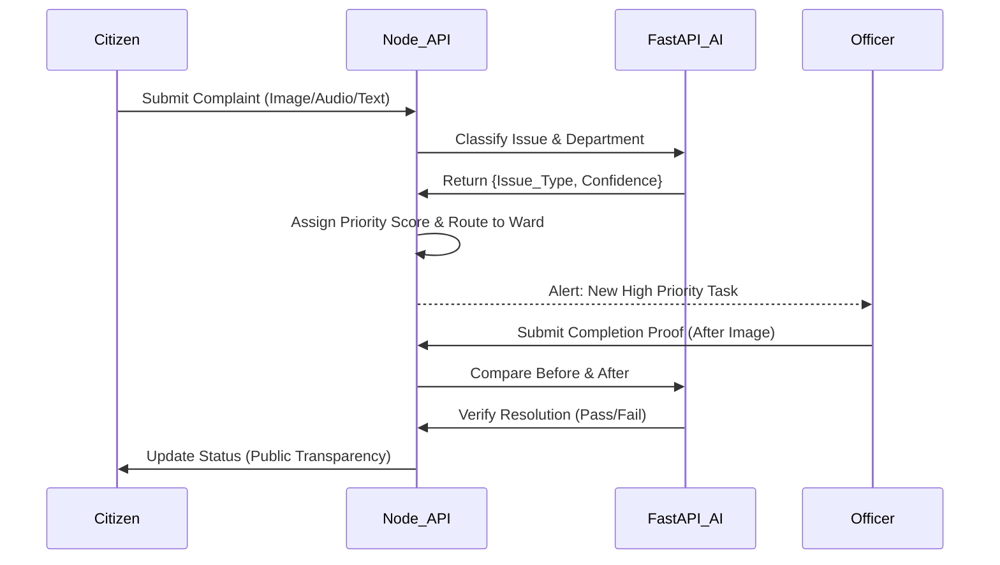

# 🕊️ LokAyukt - Smart Governance Platform
> **Team:** FireNoIce

**Accountable Governance. Every Voice Counts.**

LokAyukt is a next-generation civic intelligence platform that fuses **AI-Driven Issue Classification**, **Agentic Chatbots (LangGraph)**, and **Geospatial Analytics** to bridge the gap between citizens and municipal authorities. Beyond simple grievance logging, LokAyukt helps authorities understand the *severity, impact, and root cause* behind public complaints, driving rapid and verified resolutions.

**Stack:** React 19, Node.js (Express), Python (FastAPI/LangGraph/Transformers), PostgreSQL (Supabase), JWT Authentication, Docker.

---

## 🌟 Project Overview

### 🚩 Problem Statement
Citizens and municipal authorities are disconnected, leading to delayed resolutions and unverified work. 
*   **Information Silos**: Complaints are logged in rigid databases without intelligent routing, leading to bottlenecks.
*   **Unverified Resolutions**: Ward officers may mark tasks "resolved" without true ground-level verification.
*   **Lack of Context & Prioritization**: A critical sewage leak and a minor pothole are often treated with the same urgency due to a lack of automated triage.

### 🎯 Our Solution
**LokAyukt** acts as an intelligent, automated operational console for municipal governance.

1.  **AI-Powered Prioritization Engine**: Automatically calculates a priority score (0-100) based on urgency, impact, and recurrence for every complaint.
2.  **Agentic AI Support (LokaYuktai)**: Role-specific AI chatbots (Citizen, Ward Officer, Admin) powered by **LangGraph** assist users 24/7, fetching live data and automating tasks.
3.  **Automated ML Verification**: Uses Vision models to compare 'Before' and 'After' images, ensuring officers provide legitimate proof of resolution.
4.  **Live Heatmap Analytics**: Geospatial clustering allows administrators to spot infrastructure failures before they become crises.

---

## 🏗️ System Architecture

### 🏛️ High-Level Architecture


### 🧠 The Intelligence Pipeline
How we turn civic complaints into verified actions.



---

## ✨ Core Features Explained

### 🚀 Role-Specific Agentic Support (LokaYuktai)
*The automated workforce of LokAyukt.*

Using **FastAPI** and **LangGraph**, we engineered stateful ReAct agents tailored to specific user roles:
1.  **Citizen Agent**: Empathetic assistant that helps log complaints, tracks grievance status, and broadcasts public transparency updates.
2.  **Ward Officer Agent**: Administrative assistant that filters the ward's queue, highlights high-priority tasks, and updates statuses dynamically.
3.  **Municipal Admin Agent**: Strategic advisor that synthesizes macro-level data, analyzing spatial clusters to deduce infrastructure root causes.

### 🏗️ Smart Resource Allocation
*Deploying municipal assets where they are needed most.*

LokAyukt moves beyond static budgeting by providing dynamic resource management tools:
*   **Data-Driven Deployment**: Admin and Ward Officers can allocate workers, equipment, and funds directly to high-priority complaints and anomaly clusters detected by the heatmap.
*   **Demand Forecasting**: By analyzing the recurrence and density of civic issues, the platform highlights which wards are under-resourced, enabling proactive municipal planning rather than reactive scrambling.

### 💼 Priority Scoring & Triage
*Focusing on what matters most.*

Complaints are no longer first-come, first-serve. The system calculates a dynamic Priority Score:
*   **Urgency Score**: Derived from the AI classification (e.g., 'Water Contamination' > 'Littering').
*   **Impact Score**: Logarithmic scaling based on the volume of similar complaints in the same ward over the last 48 hours.
*   **Recurrence Score**: Identifies chronic failures by analyzing 7-day historical averages.
*   **Result**: Officers are presented with an automatically sorted queue of critical interventions.

### 🛡️ ML Vision Proof Verification
*Trust, but verify computationally.*

When a ward officer claims a task is completed:
*   They must upload an "After" photo.
*   The unified AI service compares it against the initial "Before" photo or runs it through anomaly-detection vision models.
*   Status automatically updates to **Resolved** if confidence is > 70%, or flags the task for **Admin Review** if the proof looks suspicious or AI-generated.

### 📊 Interactive Dashboards & Live Geospatial Mapping
*Premium Design. Instant Clarity.*

The frontend is tailored to withstand active monitoring.
*   **Admin Heatmaps**: Real-time Leaflet.js maps displaying civic hotspots, letting admins visualize structural decay.
*   **Officer Queues**: Color-coded, prioritized task lists grouped by department.
*   **Cross-Device Cloud Storage**: All evidence and audio files are piped to **Supabase Storage**, ensuring teammates can review proof on any device seamlessly.
    
---

## 🛠️ Technology Stack

### 🧠 AI & Backend Intelligence
*   **Python 3.10+**: Core language for the Unified-AI service.
*   **FastAPI**: High-performance async API orchestrating model inference.
*   **LangGraph**: Stateful, multi-actor orchestration for Chat Agents.
*   **Llama 3.3 (Groq)**: Blazing fast LLM inference powering conversational interfaces.
*   **Transformers / PyTorch**: Multi-modal classification for text, audio, and image validation.

### 💻 Frontend
*   **React 19**: Latest React features for a responsive UI.
*   **Vite**: Blazing-fast build tool.
*   **TailwindCSS**: Utility-first styling with custom governance-themed design tokens (glassmorphism, subtle gradients).
*   **Leaflet.js**: Interactive geospatial clustering mapping.
*   **Lucide React**: Beautiful, consistent iconography.

### ⚙️ Backend API & Infrastructure
*   **Node.js & Express**: API gateway, auth handler, and database synchronizer.
*   **PostgreSQL (Supabase)**: Relational mapping of wards, complaints, and polls.
*   **Supabase Storage**: Centralized cloud bucket for all multimedia evidence.
*   **Docker & Docker Compose**: 3-tier containerization (Frontend, Backend, Unified-AI) ensuring identical environments.

---

## 🔌 API Endpoints (Core)

### Complaints & Flow
*   `POST /api/v1/complaints/create` - AI classifies input and calculates priority.
*   `GET /api/v1/complaints/ward/:ward_id` - Get sorted priority queue for officers.
*   `POST /api/v1/complaints/:id/verify-resolution` - Push proof to ML Vision for automated status updates.

### Agentic Intelligence (FastAPI)
*   `POST /chat/citizen` - Trigger stateful LangGraph citizen flow.
*   `POST /chat/ward` - Trigger ward officer assistant flow.
*   `POST /chat/admin` - Trigger macro-analytical advisor.

### Spatial Data
*   `GET /api/v1/map/heatmap/city/:id` - Generates density clusters for the front-end maps.

---

## 🚀 Quick Start

### Prerequisites
*   Node.js v18+
*   Python 3.10+
*   Docker & Docker Compose

### Installation

1.  **Clone the Repository**
    ```bash
    git clone https://github.com/heisenbug-collective/sankalp-irl.git
    cd Sankalp.irl
    ```

2.  **Environment Variables**
    Create a `.env` file in the `Backend` directory:
    ```env
    PORT=5001
    DB_USER=...
    DB_PASSWORD=...
    DB_HOST=...
    SUPABASE_URL=...
    SUPABASE_ANON_KEY=...
    JWT_SECRET=...
    GROQ_API_KEY=...
    ```

3.  **Run with Docker Compose**
    ```bash
    docker compose up --build
    ```
    *Access the Frontend at `http://localhost:5173`*

---

## 🤝 Team: FireNoIce

| Name | Role |
| :--- | :--- |
| **Aryan Agarwal** | **Full Stack**|
| **Swastik Gupta** | **Backend Development & AI**|
| **Saharsh Srivastava** | **Machine Learning**|
| **Daksh Parekh** | **Machine Learning and Backend**|

---

Made with ❤️ by Team FireNoIce.
